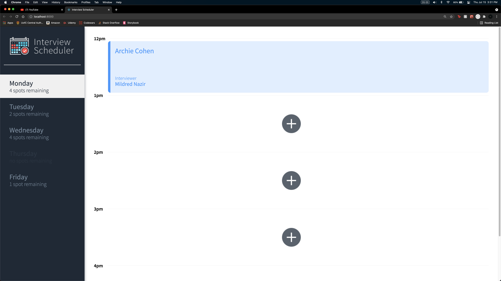
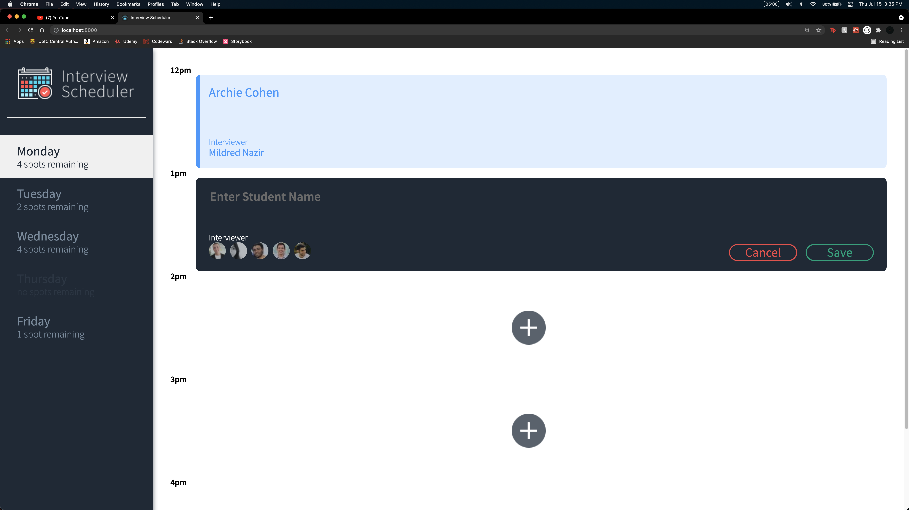
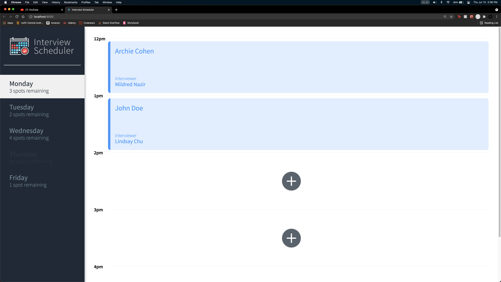

# Interview Scheduler

## Warning
This project was developed on an M1 machine, and was using a Rosetta Terminal for the sole purpose of running older node versions and other dependencies.

## Setup

* Install dependencies with `npm install`.
* Clone [scheduler-api](https://github.com/JohnLowie4/scheduler-api) and follow the instructions.
* Open one terminal and run `npm start` in the scheduler-api root directory
* Open another terminal and run `npm start` in the scheduler root directory

## Running Webpack Development Server

```sh
npm start
```

## Running Jest Test Framework

```sh
npm test
```

## Running Storybook Visual Testbed

```sh
npm run storybook
```

## Final Product




## NPM and Node versions
* npm: 6.9.0
* node: 10.16.1

## Dependencies
* axios: ^0.21.1
* react-hooks-testing-library: ^0.6.0
* react-test-renderer: ^16.9.0